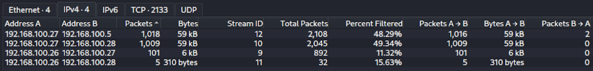
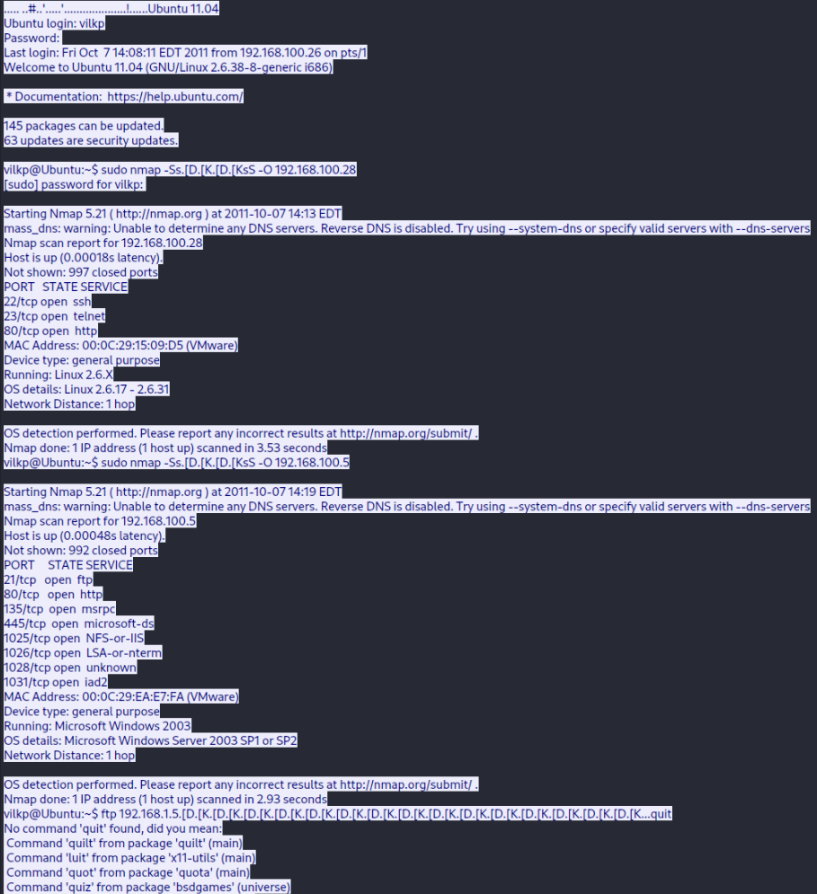
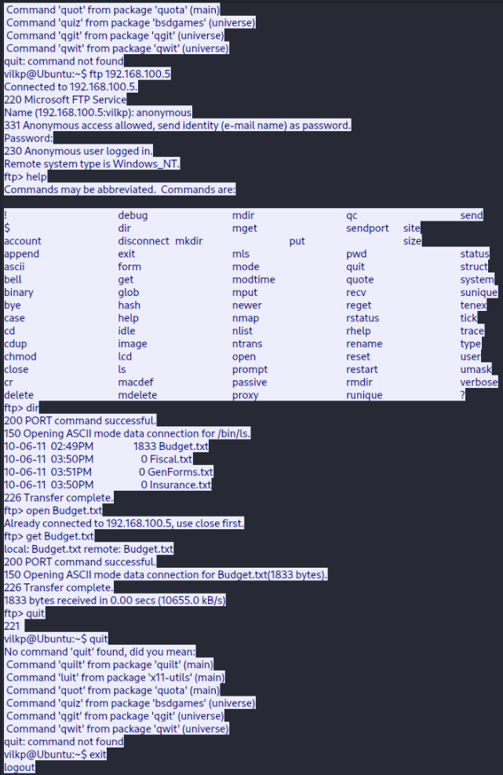
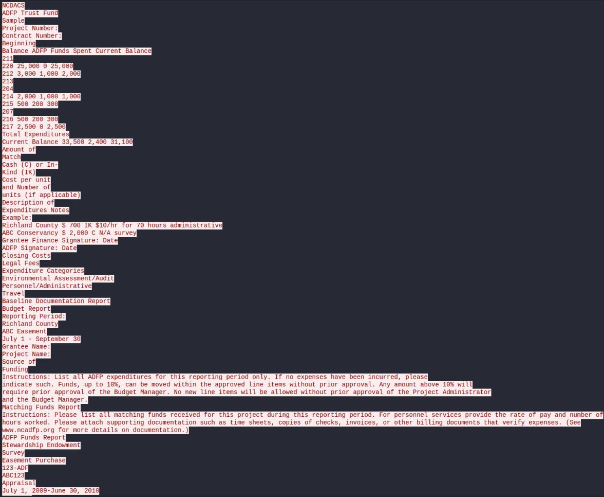

# Incident Response Report: Lateral Movement & Data Exfiltration

## Executive Summary
Palindrome Incident Response was engaged by a small business client to investigate an abnormal spike in network traffic. Analysis of the provided `.pcap` file revealed an opportunistic lateral movement attack resulting in the exfiltration of internal data. The threat actor leveraged compromised internal assets to scan the network, exploit cleartext protocols, and utilize anonymous FTP access to steal a sensitive file.

## 1. Network Topography & Asset Identification
The affected network operates on the `192.168.100.0/24` subnet. During the initial enumeration phase, four primary assets were identified:

* **Bob's Workstation (Initial Breach Point):** `192.168.100.26` (Windows XP) | MAC: `00:0C:29:94:F2:0D`
* **Sarah's Workstation (Pivot Node):** `192.168.100.27` (Ubuntu) | MAC: `00:0C:29:81:09:11`
* **Admin Server (Web):** `192.168.100.28` (Ubuntu, Apache/2.2.16) | MAC: `00:0C:29:15:09:D5`
* **DHCP / FTP Server:** `192.168.100.5` (Windows) | MAC: `00:0C:29:EA:E7:FA`

## 2. Initial Access & Reconnaissance
The attacker initiated their internal network reconnaissance from Bob's Windows XP workstation (`.26`).

* **Port Scanning:** Traffic analysis utilizing Wireshark filters (`tcp.flags.syn == 1 and tcp.flags.ack == 0`) identified a series of Nmap TCP SYN (Stealth) scans. The window sizes (`Win = 1024, 2048, 3072, 4096`) confirmed the Nmap fingerprint.
* **Targets:** The scans originating from `.26` targeted Sarah's Ubuntu workstation (`.27`), the Admin Server (`.28`), and the DHCP/FTP Server (`.5`).

**Web Server Reconnaissance:** Following the port scans, the threat actor utilized Bob's workstation (`.26`) to access the Admin Web Server (`.28`, running Apache/2.2.16). A standard HTTP GET request was captured requesting the `/contact.html` file using a Firefox 5.0 browser on Windows NT 5.1.

## 3. Lateral Movement & Privilege Escalation
After identifying open ports, the attacker moved laterally from Bob's workstation to Sarah's Ubuntu machine (`.27`).

* **Cleartext Exploitation:** The attacker established a Telnet connection (Port 23) from `.26` to `.27`. 
* **Compromised Credentials:** The attacker successfully logged in using the weak credentials `vilkp` / `password`.
* **Privilege Escalation:** Once logged into `.27`, the attacker used the same password to execute commands with root privileges (e.g., `sudo nmap -sS -O 192.168.100.28`), effectively masking their original IP and bypassing perimeter defenses.

## 4. Data Exfiltration
Operating from the compromised Ubuntu machine (`.27`), the attacker targeted the Windows DHCP/FTP server (`.5`).

* **Anonymous Access:** The attacker connected to the FTP service using the credentials `anonymous` : `yeah@right.com`.
* **Exfiltration:** The attacker executed the `LIST` command to map the directory, followed by the `RETR` command to successfully download the file `Budget.txt` to the `.27` machine.
* **Session Termination:** The attacker subsequently closed the connection using the `QUIT` command.

## 5. Timeline of Events (2011-10-07)
* **14:12:00 UTC:** Initial cleartext Telnet connection established from `.26` to `.27`.
* **14:21:55 UTC:** Primary Telnet session terminated.
* **18:17:50 UTC:** Reconnaissance HTTP GET request made from `.26` to the Admin Web Server (`.28`).
* **18:20:49 UTC:** Anonymous FTP connection initiated from the compromised `.27` machine to the DHCP/FTP Server (`.5`). Exfiltration of `Budget.txt` occurs shortly after. 

## 6. Threat Actor Profiling
The threat actor demonstrated a **low level of technical sophistication**. 

The attack relied entirely on opportunistic exploitation of poorly configured, legacy cleartext services (Telnet, FTP) and default/weak credentials. The attacker made no attempt to establish encrypted Command and Control (C2) channels, utilize evasion techniques, or obfuscate their commands. As a result, all lateral movement and the exfiltrated `Budget.txt` payload were fully visible in plain text within the network traffic.

## 7. General Network Security Recommendations
Based on the environmental findings, the following systemic risks must be addressed to prevent future incidents:

* **Protocol Hardening:** Immediately disable Telnet and FTP. Replace them with encrypted alternatives such as SSH and SFTP.
* **Credential Policies:** Enforce strong password policies to prevent the exploitation of weak credentials (e.g., `password`). Disable anonymous FTP access.
* **DHCP Security:** The environment is currently vulnerable to DHCP Starvation and Rogue DHCP attacks. Implement DHCP Snooping and port security on network switches to prevent IP pool depletion and Man-in-the-Middle (MitM) interceptions.
