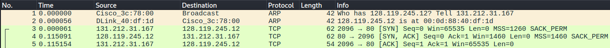
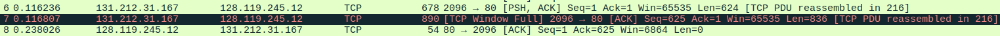
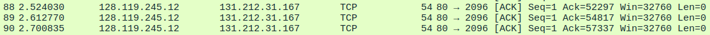

# Lab 1: Network Traffic Analysis (TCP & HTTP)

## Overview
In this lab, I ran a deep-packet inspection (DPI) on a network trace file (`tcp-ethereal-file1.trace`) to get a look under the hood of an HTTP file transfer. The main goal here was to map out the endpoints, verify the TCP 3-way handshake, spot any network bottlenecks (flow control), and crunch the numbers for the overall connection throughput. 

## 1. Endpoints & Connection Setup
Looking at the trace, it's a standard client-server setup running over unencrypted HTTP.

* **Target Server:** `gaia.cs.umass.edu` | IP: `128.119.245.12` | Port: `80`
* **Source Client:** IP: `131.212.31.167` | Ephemeral Port: `2096`

I verified that the connection was set up using a proper TCP 3-way handshake. The client kicked things off with a relative Sequence Number of `0` (you can see the `SYN` flag set to 1 in the TCP header). The server then hit back with a `SYN-ACK` segment, setting the acknowledgment value to `1` and its own initial Sequence Number to `0`.

*Figure 1: The initial SYN and SYN-ACK packets establishing the connection.*

## 2. HTTP Payload & Segment Sizes
Once the handshake was out of the way, the client sent an HTTP `POST` command to start the data transfer. I checked out the first six TCP segments of the payload, which broke down like this:

* **Segment 1 (Packet 6):** 624 bytes
* **Segment 2 (Packet 7):** 836 bytes
* **Segments 3 through 6:** 1,260 bytes each.

Since the segment sizes stabilized at 1,260 bytes, it's safe to say that's the Maximum Segment Size (MSS) the network utilized for the bulk of the transfer.

## 3. Flow Control & Network Bottlenecks
Next, I wanted to see if the network was struggling at all by looking for packet loss, retransmissions, or buffer issues during the transfer.

* **Receiver Throttling:** The server's starting receiver buffer (Win) was set to 1,460 bytes. It actually had to throttle the sender pretty early on. Around Packet 7, the buffer filled up, which threw a `[TCP Window Full]` flag in Wireshark. This forced the client to pause transmission for a moment until the server could catch up and process the queued data.

*Figure 2: Wireshark identifying the TCP Window Full bottleneck at Packet 7.*

* **Packet Loss & Retransmission:** Even with that temporary bottleneck, the connection was super solid. I didn't catch any retransmissions. I proved this by tracking the Sequence Numbers, as they increased monotonically (e.g., 625 -> 1461 -> 2721) without any repeating sequence values.

## 4. Acknowledgment Mechanisms & Throughput
To finish up, I looked at how the server was acknowledging the data and calculated the actual speed of the connection.

* **Cumulative ACKs:** Usually, the server acknowledged one full segment (1,260 bytes) at a time. But it also used cumulative ACKs to keep traffic efficient. A great example of this is at Packet 89, where the ACK number jumped by exactly 2,520 bytes. This proves the server successfully acknowledged two 1,260-byte segments at the exact same time.

*Figure 3: Tracking the acknowledgment jump in Packet 89.*

* **Overall Throughput:** I clocked the connection throughput at about **22.4 KB/sec** (~22,383 bytes/sec). 
  * *The Math:* I took the total data transferred (Ack 152997 - Seq 1 = 152,996 bytes) and divided it by the total time the transfer took (6.951s - 0.116s = 6.835 seconds).
