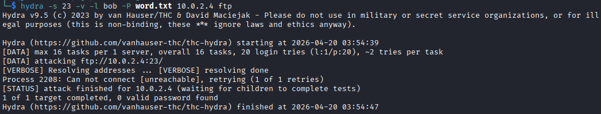
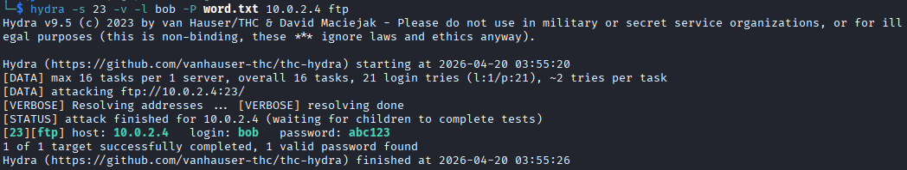
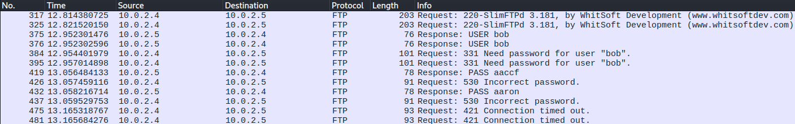

# Lab 2: FTP Dictionary Attack & Network Monitoring

## Overview
In this homelab exercise, I simulated a credential harvesting attack against a vulnerable file server. The objective was to execute an active dictionary attack using Hydra, successfully compromise the target, and simultaneously analyze the network traffic in Wireshark to understand the digital footprint left by a brute-force threat actor.

## 1. Homelab Environment Setup
To safely execute this attack, I provisioned two isolated virtual machines:

* **Target (Victim) Machine:** A Windows VM (`10.0.2.4`) running `SlimFTPd` (a lightweight FTP server). The service was configured to run on a non-standard port (**Port 23**) to simulate security-by-obscurity. I provisioned a test account (`bob`) secured with a weak, predictable password (`abc123`) and hosted a simulated sensitive file (`confidential.txt`).
* **Attacker Machine:** A Kali Linux VM equipped with `Hydra` (a parallelized network logon cracker) and `Wireshark` for packet capture.

## 2. Attack Execution (Hydra)
I initiated the attack using a targeted dictionary approach. 

### Phase 1: The Failed Attempt
First, I pointed Hydra at the target IP using a standard, unedited password wordlist (`word.txt`). Because the service was hiding on a non-standard port, I had to explicitly declare Port 23 in the attack parameters using the `-s` flag.
> **Command run:** `hydra -s 23 -v -l bob -P word.txt 10.0.2.4 ftp`

Hydra executed 20 rapid authentication attempts against the server. Because the specific password (`abc123`) was not in the default wordlist, the attack failed, resulting in `0 valid passwords found`. This demonstrated the primary limitation of dictionary attacks: they are only as good as the wordlist provided.

*Figure 1: Hydra exhausting the initial wordlist without a successful hit.*

### Phase 2: The Compromise
To simulate a more comprehensive or custom-tailored wordlist (such as one generated by OSINT or a previous breach), I appended the correct password (`abc123`) to the bottom of `word.txt` and relaunched the exact same Hydra command. 

Hydra rapidly iterated through the list again and successfully cracked the authentication, outputting the valid credentials in green. With these credentials, I was able to successfully access the FTP share.

*Figure 2: Hydra successfully identifying the valid FTP credentials on Port 23.*

## 3. Network Threat Detection (Wireshark Analysis)
While the attack was running, I monitored the network interface using Wireshark to understand how this attack looks to a network defender. 

Because FTP is a legacy, cleartext protocol, the dictionary attack was incredibly "loud" and easy to detect, even when running on a non-standard port. The packet capture revealed a rapid sequence of TCP connections where the `USER bob` command was immediately followed by various `PASS [attempt]` commands. Every single password guess from the wordlist was entirely visible in plain text.

*Figure 3: Wireshark capturing the cleartext password guesses in real-time.*

## 4. Defensive Remediation
If I were responding to this incident in a live enterprise environment, the immediate remediation steps would be:
1. **Deprecate Cleartext Protocols:** Immediately disable legacy FTP. Relying on "security by obscurity" (like hiding FTP on Port 23) does not protect data. Replace it with SFTP (SSH File Transfer Protocol) or FTPS to ensure all authentication traffic is encrypted.
2. **Implement Account Lockouts:** Configure the server to lock the account or temporarily drop the IP address after 3 to 5 failed authentication attempts, which mathematically defeats automated brute-force attacks.
