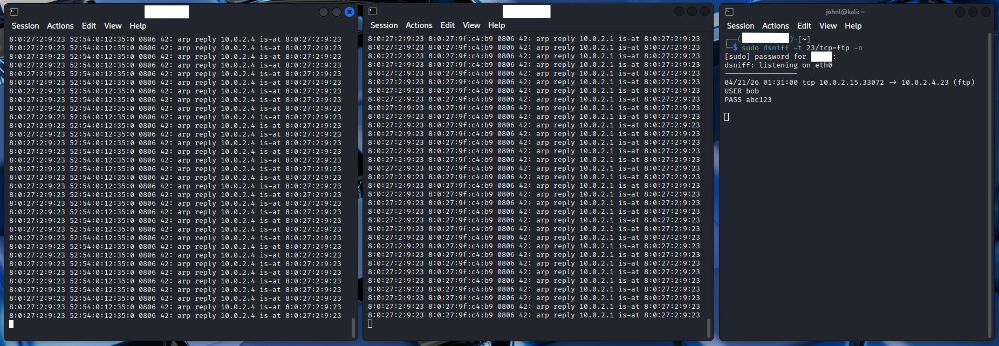
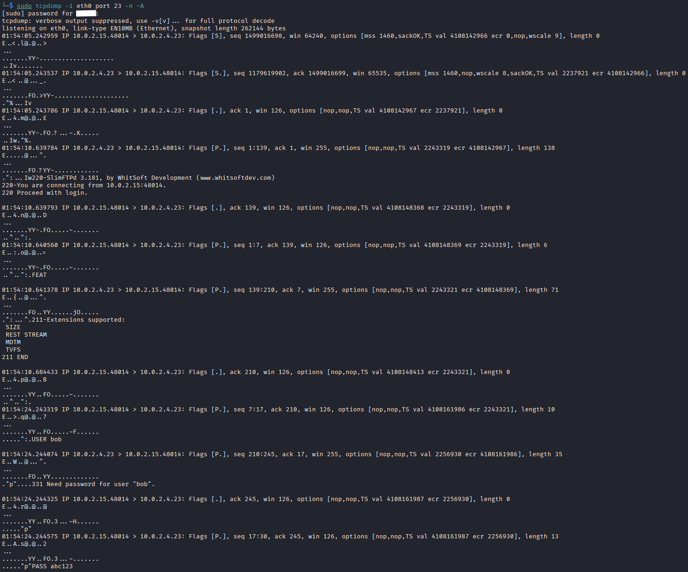

# Lab 3: Man-in-the-Middle (MitM) Attack & ARP Poisoning

## Overview
In this lab, I executed a **Passive Man-in-the-Middle (MitM)** attack using **ARP Poisoning**. By positioning my Kali Linux machine between the target server and the network gateway, I intercepted, forwarded, and sniffed cleartext FTP credentials. This exercise demonstrates the inherent lack of authentication in the ARP protocol and the risks of utilizing unencrypted legacy services.

## 1. Homelab Environment Setup
To simulate a network interception, I utilized three distinct virtual machines within a localized subnet:

* **Victim 1 (Server):** A Windows VM (`10.0.2.4`) running `SlimFTPd` on Port 23.
* **Victim 2 (Client):** An Ubuntu VM used to simulate a legitimate user accessing the FTP server (`ftp://10.0.2.4:23`).
* **Attacker Machine:** A Kali Linux VM (`10.0.2.5`) acting as the interceptor.
* **Network Gateway:** The virtual router (`10.0.2.1`) handling subnet traffic.

## 2. Attack Execution
The attack followed a three-phase execution strategy: traffic forwarding, ARP cache poisoning, and credential sniffing.

### Phase 1: Enabling IP Forwarding
To prevent a Denial of Service (DoS) for the victims, I configured the Kali machine to act as a transparent bridge, forwarding packets to their intended destination after interception.
> **Command:** `sudo sysctl -w net.ipv4.ip_forward=1`

### Phase 2: ARP Poisoning (arpspoof)
I used `arpspoof` to send forged ARP replies to both the Gateway and the Windows Server. This tricked both devices into mapping the other's IP address to my Kali machine's MAC address.
1.  **Poisoning the Gateway:** `sudo arpspoof -i eth0 -t 10.0.2.1 10.0.2.4`
2.  **Poisoning the Server:** `sudo arpspoof -i eth0 -t 10.0.2.4 10.0.2.1`

### Phase 3: Passive Sniffing (dsniff)
With the traffic successfully routed through my machine, I used `dsniff` to monitor for authentication patterns. 
> **Command:** `sudo dsniff -t 23/tcp=ftp -n`

When the Ubuntu client initiated a session, `dsniff` captured the cleartext credentials in real-time.

*Figure 1: dsniff intercepting the cleartext credentials (bob / abc123) via the hijacked route.*

## 3. Network Analysis (tcpdump)
While the attack was active, I monitored the `eth0` interface with `tcpdump` to verify the "gratuitous ARP" replies. The capture confirms a high-frequency stream of ARP packets originating from my Kali MAC, which is the primary indicator of an ongoing ARP spoofing attempt.

*Figure 2: tcpdump identifying the anomalous ARP reply frequency used to maintain the MitM position.*

## 4. Defensive Remediation
To mitigate ARP-based Man-in-the-Middle attacks in production:
1.  **Dynamic ARP Inspection (DAI):** Implement DAI on enterprise switches to validate ARP packets against a trusted DHCP Snooping binding database.
2.  **Static ARP Mapping:** Manually map MAC addresses for critical paths (e.g., Server to Gateway) to prevent dynamic cache overrides.
3.  **Encrypted Protocols:** Use **SFTP** or **SSH**; even if an attacker successfully intercepts the traffic, the encrypted payload remains unreadable.
