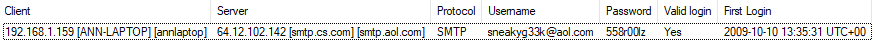
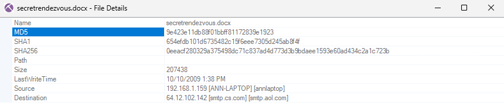
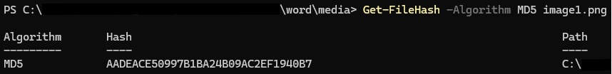

# Lab 4: Network Forensics & Artifact Extraction (NetworkMiner)

## Overview
In this scenario-based lab, I acted as a forensic investigator analyzing a packet capture (`.pcap`) from a suspect who violated their bail conditions. The objective was to utilize deep packet inspection to analyze cleartext communications, recover compromised credentials, and extract file attachments to determine the suspect's flight plan and destination.

## 1. Forensic Environment Setup
To ensure a safe and controlled investigation, the analysis was conducted within an isolated virtual homelab:
* **Analysis Sandbox:** Windows 11 Virtual Machine.
* **Forensic Tool:** NetworkMiner (an open-source Network Forensic Analysis Tool used for packet parsing and artifact extraction).
* **Evidence File:** `Network-Evidence-02.pcap` (MD5: `cfac149a49175ac8e89d5b5b5d69bad3`)

## 2. Investigation Findings
By importing the `.pcap` into NetworkMiner, I was able to parse the network traffic and automatically reconstruct the unencrypted SMTP email exchanges. 

### A. Identities & Compromised Credentials
Because the suspect communicated over unencrypted email, I successfully recovered their login credentials and contact details in cleartext:
* **Suspect Email:** `sneakyg33k@aol.com`
* **Account Password:** `558r00lz`
* **Accomplice Email:** `mistersecretx@aol.com`

*Figure 1: NetworkMiner automatically parsing and displaying the compromised SMTP credentials.*

### B. Communications & Flight Plans
Analyzing the extracted email bodies revealed two separate outbound messages that confirmed the suspect's flight intent and escape plan:

* **Message 1 (Departure Confirmation):** Sent to `sec558@gmail.com` with the subject "lunch next week". The message body read: *"Sorry-- I can't do lunch next week after all. Heading out of town. Another time! -Ann"*
* **Message 2 (Escape Instructions):** Sent to the accomplice (`mistersecretx@aol.com`). In this message, the suspect instructed them to bring two specific items for the meetup:
    1. A fake passport
    2. A bathing suit

Based on the recovered messages, the rendezvous destination was identified as **Playa del Carmen, Mexico**.

*Figure 2: The contents of the intercepted communications revealing the rendezvous location and escape instructions.*

### C. File Extraction & Cryptographic Hashing
The suspect also transmitted a document containing further rendezvous details. NetworkMiner successfully carved this attachment directly from the packet capture. To maintain the chain of custody and forensic integrity, I generated cryptographic hashes for the recovered files.

* **Extracted File Name:** `secretrendezvous.docx`
* **Attachment MD5:** `9e423e11db88f01bbff81172839e1923`

*Figure 3: The carved secretrendezvous.docx file extracted directly from the network traffic.*

#### Advanced Artifact Recovery (Embedded Media)
The `.docx` file contained an embedded image mapping out the meetup location. Since standard network carving tools do not automatically extract nested files, I performed a manual extraction by treating the `.docx` document as a ZIP archive. 

After changing the extension to `.zip` and extracting the contents, I navigated to the internal `word/media` directory. From there, I utilized Windows PowerShell to calculate the MD5 hash of the isolated image, ensuring the artifact was properly documented.

> **Command run:** `Get-FileHash -Algorithm MD5 image1.png`

* **Embedded Image MD5:** `AADEACE50997B1BA24B09AC2EF1940B7`

*Figure 4: Utilizing PowerShell to manually calculate the MD5 hash of the nested image artifact.*

## 3. Conclusion & Takeaways
This investigation highlights the practical dangers of using unencrypted protocols like legacy SMTP for sensitive communications. Because the data was transmitted in cleartext, a passive network tap was all it took to intercept passwords, read messages, and extract files without requiring any direct compromise of the endpoints.
