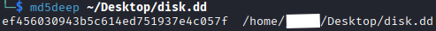
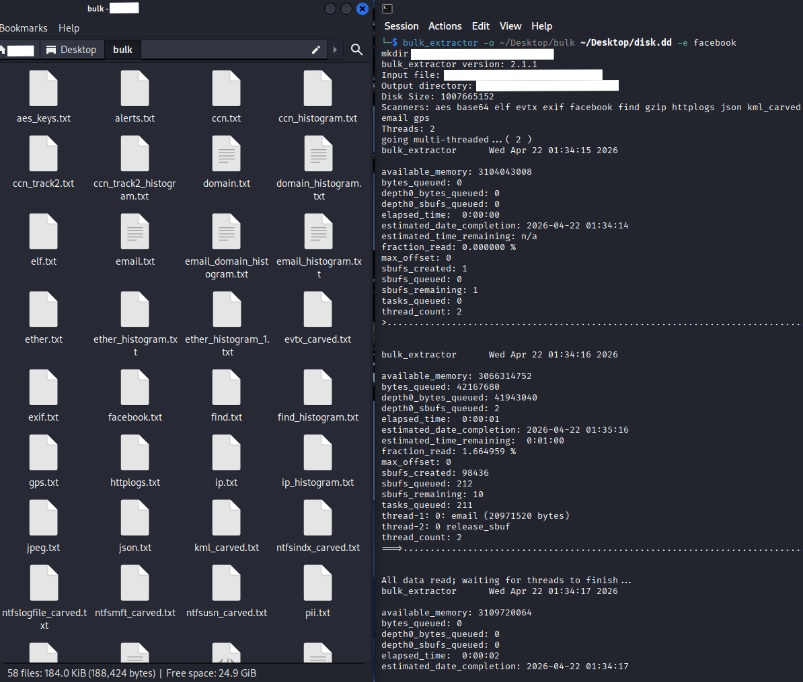
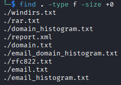
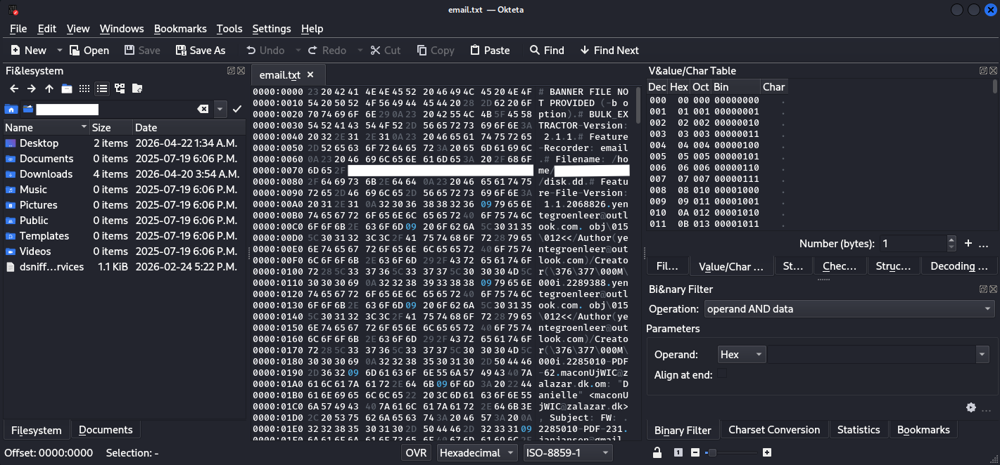

# Lab 5: Disk Forensics & File Carving (Bulk Extractor & Okteta)

## Overview
For this final lab, I took on the role of a forensic analyst examining a raw USB drive image (`disk.dd`). The objective was to practice proper evidence handling by establishing a chain of custody, utilize file carving techniques to extract hidden artifacts (like emails and visited domains), and analyze the raw hexadecimal data to uncover obscured content.

## 1. Forensic Environment Setup
To ensure the integrity of the disk image, all analysis was performed within a secure Linux environment:
* **Analysis Sandbox:** Kali Linux Virtual Machine.
* **Forensic Tools:** `md5deep` (Hashing), `bulk_extractor` (Data Carving), `okteta` (Hex Editor).
* **Evidence File:** `disk.dd` (Raw USB image dump).

## 2. Investigation Findings
The investigation was broken down into three strict phases: Hashing, Carving, and Raw Analysis.

### A. Chain of Custody (Cryptographic Hashing)
In digital forensics, you never interact with an evidence file before verifying its integrity. Before attempting to extract any files, I generated an MD5 hash of the raw `disk.dd` image. This ensures that any subsequent analysis does not alter the original evidence.

> **Command run:** `md5deep ~/Desktop/disk.dd`

 
*Figure 1: Generating the baseline cryptographic hash of the USB image before analysis.*

### B. Bulk Data Carving & Artifact Filtering
With the baseline established, I utilized `bulk_extractor` to scan the raw disk image for recognizable data signatures without relying on a file system allocation table. This allows for the recovery of "deleted" or fragmented data. 

I also enabled specialized scanners (such as the Facebook and Wordlist extractors) to pull out specific network artifacts.

> **Command run:** `bulk_extractor -o ~/Desktop/bulk ~/Desktop/disk.dd -e facebook`

Because `bulk_extractor` generates a text file for every scanner even if no data is found, I used the Linux `find` command to filter out all the empty 0-byte files. This immediately eliminated the noise and isolated the actual evidence, including active directories, domain logs, and email records.

> **Command run:** `find . -type f -size +0`

 
 
*Figure 2: Running bulk_extractor and utilizing the find command to filter the results, isolating only non-empty artifact files.*

### C. Raw Data Analysis (Hex Editing)
From the filtered results, I specifically targeted the recovered `email.txt` artifact. To dig deeper into carved files, standard text editors are often insufficient. I utilized `okteta`, a robust hexadecimal editor, to inspect the raw bytes of the extracted file.

> **Command run:** `okteta email.txt`

Opening the file in Okteta allowed me to view the data in both traditional hex columns and character encodings. This deeper level of inspection is critical for identifying file signatures (magic bytes), extracting obfuscated strings, and understanding the exact data structure of the recovered email artifact.

 
*Figure 3: Utilizing Okteta to analyze the raw hexadecimal values and ASCII representations of the carved email.txt file.*

## 3. Conclusion & Takeaways
This lab demonstrated the persistence of data on physical media. Even if a file system is wiped or files are "deleted," a raw disk image (`.dd`) still contains the fragmented data. By combining proper hashing techniques with robust carving tools like `bulk_extractor` and `okteta`, it is entirely possible to reconstruct a user's digital footprint directly from the raw bytes.
